<h3><code>BeyondBatCode@github ~ $ ./contributions.sh</code></h3>

  

<h3><code>BeyondBatCode@github ~ $ whoami</code></h3>
<table>
  <tr>
    <td valign="top"></td>
    <td valign="top"></td>
  </tr>
</table>

<!--
Widths above are matched on purpose: contrib-heatmap.svg is 860px wide,
which equals the two columns below it (370 + 490), so the edges line up.

GitHub markdown gotchas:
  - Inline `style="..."` is stripped. The only vertical spacing GitHub
    honors is   tags.
  - <h1>/<h2> draw a full-width underline rule; use <h3> to avoid it.
  - No JavaScript, no external CSS — all animation lives inside the SVGs.
-->
